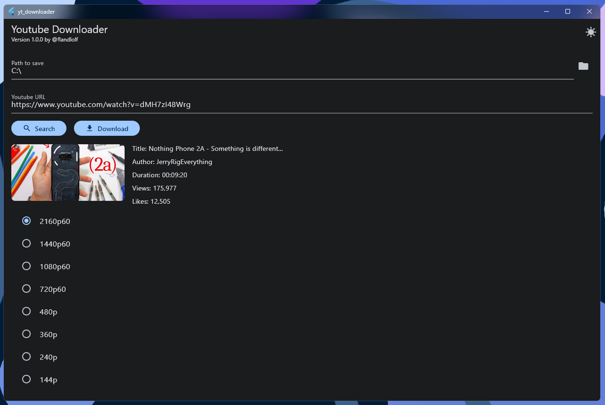

# YouTube Downloader 📺

## Description
   
A flutter app that downloads YouTube videos and audios.

## Features
- Download YouTube videos and audios.
- Quality selection for videos.
- Download progress indicator.
- Material design.
- Dark mode.

## Screenshots

## Installation
- Clone the repository.
- Run `flutter pub get`.
- Run `flutter run`.
- Enjoy!

## Contributing
Pull requests are welcome. For major changes, please open an issue first to discuss what you would like to change.

## License
This project is licensed under the MIT License - see the [LICENSE](LICENSE) file for details.

## Acknowledgements
- [youtube_explode_dart](https://pub.dev/packages/youtube_explode_dart)
- [provider](https://pub.dev/packages/provider)
- [ffmpeg](https://ffmpeg.org/)

## Author
- [GitHub](https://github.com/flandolf)
